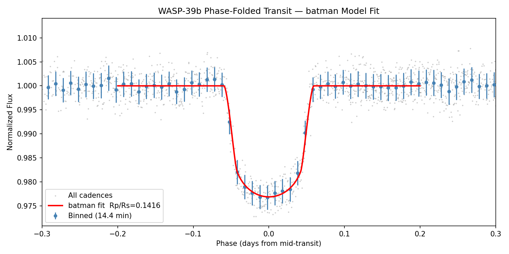

# TESS Exoplanet Transit Light Curve Analysis

A Python pipeline that takes raw TESS space-telescope photometry of the hot Jupiter **WASP-39b**, cleans it, blindly recovers the planet's orbital period, and fits a physical transit model to measure the planet's size and orbit.

This is a learning project. The goal was to understand each step of a standard transit analysis end to end, and to be honest about where the result falls short of the published values (see [Limitations](#limitations)).



## Pipeline

```
TESS data (NASA MAST archive, SPOC pipeline, 2-min cadence)
        |  Lightkurve: download, select PDCSAP flux, drop NaNs
        v
Raw light curve
        |  upward-only 5-sigma outlier clipping, median normalization,
        |  Savitzky-Golay flattening (401 cadences, ~13 h)
        v
Detrended light curve
        |  Box Least Squares (BLS) periodogram, 0.5-15 d
        v
Orbital period, transit epoch, rough depth
        |  phase-fold on the period
        v
Stacked transit
        |  batman model + Nelder-Mead chi-squared minimization
        v
Rp/Rs, a/Rs, inclination, limb-darkening coefficients
```

## Results

Data: TESS Sector 51 (SPOC, 120 s cadence, TIC 181949561), which contains three transits.

| Parameter | This analysis | Literature* | Difference |
|---|:---:|:---:|:---:|
| Orbital period (d), from BLS | 4.0558 | 4.0552 | +0.015% (~0.9 min) |
| Rp/Rs | 0.1416 | 0.1454 | -2.6% |
| a/Rs | 11.70 | 11.55 | +1.3% |
| Inclination (deg) | 88.10 | 87.83 | +0.27 deg |
| Transit depth, (Rp/Rs)^2 (ppm) | 20,042 | ~21,100 | -5% |
| Impact parameter b | 0.39 | n/a | n/a |
| Limb darkening (u1, u2) | 0.457, 0.095 | n/a | n/a |

*Literature values are the reference numbers hard-coded in the notebook for comparison; check them against the [NASA Exoplanet Archive](https://exoplanetarchive.ipac.caltech.edu/) before citing them elsewhere.

The BLS periodogram shows its strongest peak at the true period, with weaker peaks at harmonics (about 1.5x, 2x, and 3x the period), as expected for a signal with only three transits.

## Key concepts

- **Transit depth:** when a planet crosses its star, the star dims by about (Rp/Rs)^2, so the dip gives the planet's radius relative to the star.
- **PDCSAP flux:** SPOC photometry with spacecraft systematics (pointing jitter, thermal drift) partly removed.
- **Upward-only outlier clipping:** cosmic rays spike up, but a transit is a dip down. Clipping both sides at 5 sigma deletes the bottom of the transit and biases the depth low.
- **Flattening window:** the Savitzky-Golay window must be much longer than the transit (~2.8 h for WASP-39b), or the filter fits the transit as a trend and erases it.
- **BLS:** tries many trial periods and durations and picks the one where a box-shaped dip fits best.
- **batman:** a forward model that computes the transit light curve for given planet parameters; the optimizer adjusts the parameters until the model matches the data.
- **Quadratic limb darkening:** a star is dimmer at its edge than its center, which rounds the bottom of the transit. The fit is restricted to physically valid (u1, u2) combinations.

## Limitations

- **Rp/Rs is about 2.6% below the literature value.** Likely contributors: the flattening step was run without masking the transits, circular orbit (e = 0) assumed, only one sector of data, and no limb-darkening prior.
- **Starting guess:** the optimizer starts at WASP-39b's published parameters, so a good result is partly built in. Results from other starting points have not been tested.
- **No uncertainties** are reported on the fitted parameters. The natural next step is MCMC (e.g. `emcee`).
- **Duration is coarse:** BLS only samples a grid of trial durations (2.40 h is the grid point it chose; the literature duration is about 2.8 h).
- **Data loss:** the SPOC quality mask removes about 37% of the Sector 51 cadences.
- **Only Sector 51 is used.** Sector 91 (2025) is also available and would roughly double the number of transits.

## Possible extensions

- Mask transits before flattening and refit
- Stitch Sector 51 and Sector 91 together
- Fix limb-darkening coefficients from theoretical tables
- Add MCMC for parameter uncertainties
- Fit mid-transit time per transit to look for timing variations

## Setup

```bash
git clone https://github.com/akhileshm0507/tess-exoplanet-analysis
cd tess-exoplanet-analysis
pip install -r requirements.txt
jupyter notebook tess_transit_notebook.ipynb
```

Needs an internet connection on first run to download the TESS data from MAST. Tested with Python 3, lightkurve 2.6.0, batman-package 2.5.3, scipy 1.15.3, numpy 2.1.3, matplotlib 3.10.0.

## References

- Kreidberg (2015). *batman: BAsic Transit Model cAlculatioN in Python.* PASP, 127, 1161.
- Lightkurve Collaboration (2018). *Lightkurve: Kepler and TESS time series analysis in Python.* Astrophysics Source Code Library.
- Faedi et al. (2011). *WASP-39b: a highly inflated Saturn-mass planet orbiting a late G-type star.* A&A, 531, A40.
- Rustamkulov et al. (2023). *Early Release Science of the exoplanet WASP-39b with JWST NIRSpec PRISM.* Nature, 614, 659.
